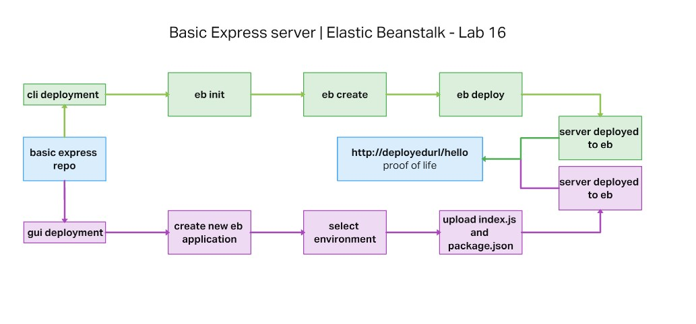

# Deploy to Elastic Beanstalk

## Code 401d48 lab 16

## Author: Robert Ball

[Server deployed via GUI](http://lab16basicexpressserver-env.eba-2czp3e3s.us-west-2.elasticbeanstalk.com/)

[Server deployed via CLI](http://lab16-eb-cli-deploy-dev.us-west-2.elasticbeanstalk.com/)

---

### Problem Domain

* Deploy a simple Node.js server to EC2, using Elastic Beanstalk

---

### Requirements

Feature Tasks

* Choose a server you’ve built previously
* Option 1: A simple API or Web Server
* Option 2: A socket.io event Hub
* The server should not require a database
* Check in your server to GitHub
* Task 1:
  * Create a new environment, using Elastic Beanstalk from the AWS Control Panel (GUI)
  * Manually deploy your application to this environment by uploading a .zip file

* Task 2:
  * Using the same server, create a new environment using Elastic Beanstalk from your terminal
  * Manually deploy your application to this environment by using eb deploy

---

Documentation:

Application UML



Below is showing the result of running

Explanation of images:

* The terminal is screenshot shows the final steps of establishing an elastic beanstalk environment using the following eb CLI commands from within the project folder:

```JSON
eb init
eb create
eb deploy
```


---
Dependencies

```JSON
  "dependencies": {
    "express": "^4.18.2"
  }
```

Setup

1. Create an AWS account and an IAM user role with appropriate permissions that allow creation of an eb environment.
2. Install the AWS and EB CLI environment onto your local machine if not already created.
3. Use AWS configure to establish your AWS IAM credentials on your local machine
4. Clone repo to your local system
5. with the repo open in your editor of choice, run:

```code
npm i
eb init
eb create
eb deploy
```

6. Your environment will automatically be setup and available for use when eb deploy finishes.
